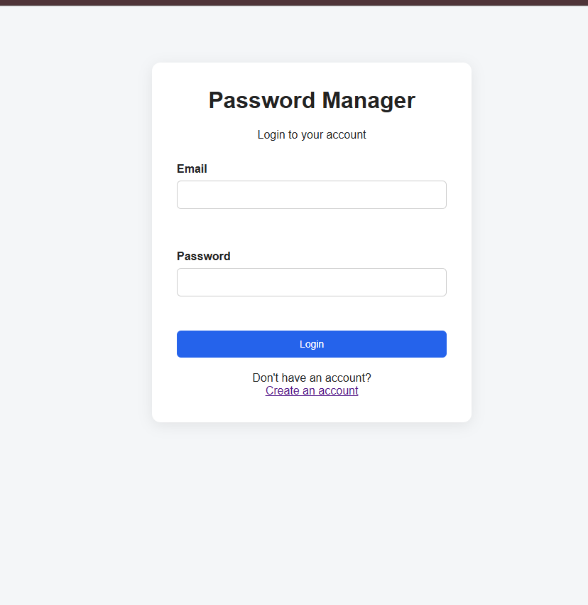
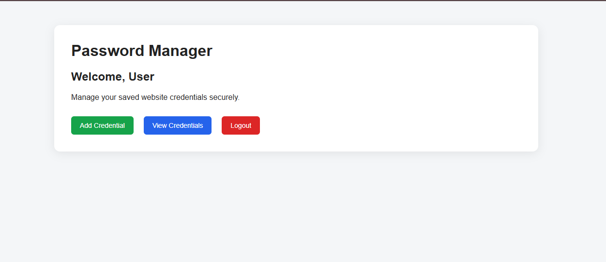
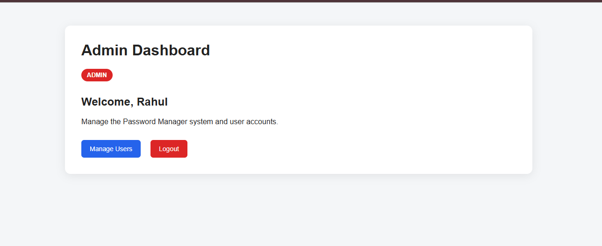

# Mini Password Manager

A web-based password management system developed using ASP.NET Web Forms,
C#, .NET Framework 4.8, SQL Server LocalDB, and ADO.NET.

## Features

- User Registration
- Secure Login
- Logout
- User and Admin Roles
- Credential CRUD Operations
- Add Website Credentials
- View Saved Credentials
- Edit Credentials
- Delete Credentials
- Search Credentials
- Password Generator
- Show/Hide Password
- Password Hashing using PBKDF2
- Credential Password Encryption
- User-specific Credential Access
- Admin User Management
- Role Management
- Delete Confirmation
- SQL Transaction for User Deletion

## User Role

Users can:

- Add credentials
- View their credentials
- Search credentials
- Edit credentials
- Delete credentials

## Admin Role

Admins can:

- View users
- Change user roles
- Delete users
- Manage the system

Admins cannot:

- Delete their own account
- Change their own Admin role
- Remove the last Admin account

## Technologies

- ASP.NET Web Forms
- C#
- .NET Framework 4.8
- SQL Server LocalDB
- ADO.NET
- HTML
- CSS
- JavaScript

## Database

Database:

PasswordManagerDB

Tables:

- Users
- Credentials

## Security

The project implements:

- PBKDF2 password hashing
- Random password salt
- AES-based credential encryption
- Session authentication
- Role-based authorization
- Parameterized SQL queries
- User-specific credential filtering
- SQL transactions
- Admin protection

## Project Structure

Password Manager/
├── Login.aspx
├── Register.aspx
├── Dashboard.aspx
├── AddCredential.aspx
├── ViewCredentials.aspx
├── AdminDashboard.aspx
├── ManageUsers.aspx
├── EncryptionHelper.cs
├── Style.css
└── Web.config

## Screenshots

### Login

### User Dashboard

### Admin Dashboard

## Documentation

The complete project documentation is available in:

Documentation/Mini_Password_Manager_Documentation_Report.docx

## Disclaimer

This project was developed for academic and learning purposes.
The security implementation should be further strengthened before
being used as a production password manager.
